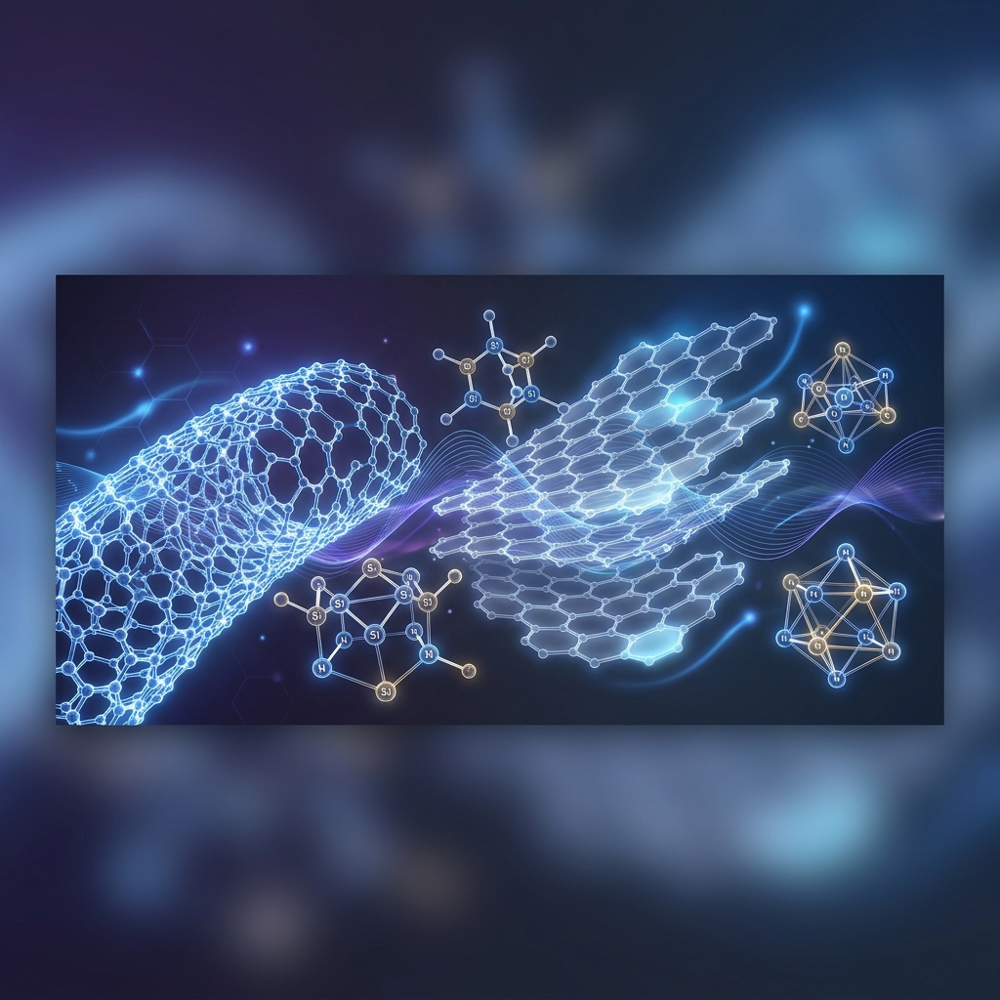
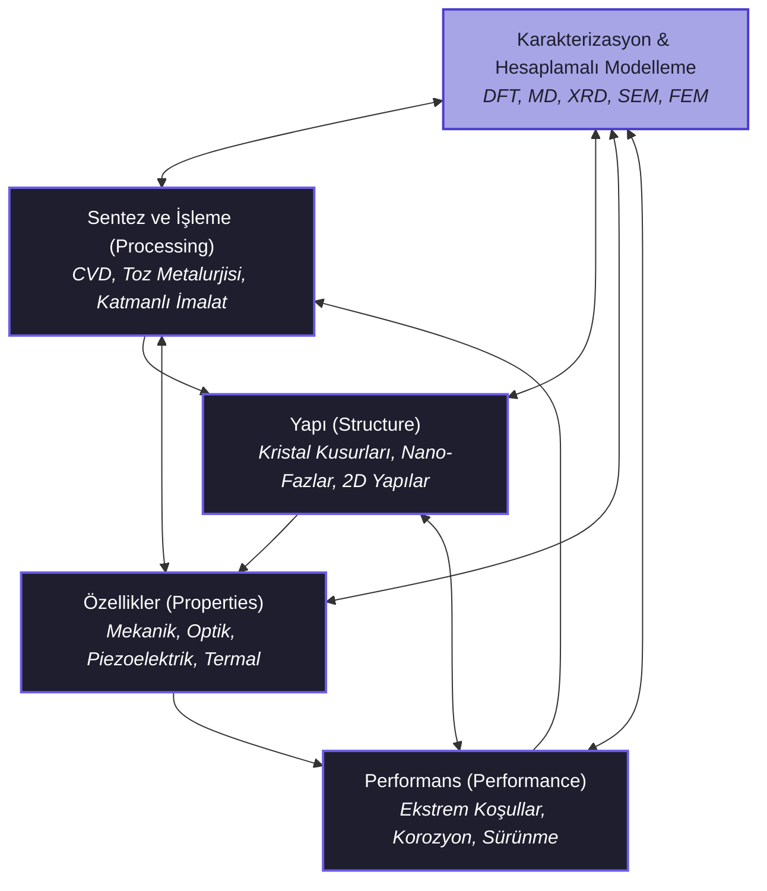

# 🔬 İleri Malzemeler Müfredatı (Advanced Materials Curriculum)

[](https://opensource.org/licenses/MIT)
[](#)
[](#)

<p align="center">
  
</p>

Bu depo, geleneksel metalurji ve malzeme biliminin ötesine geçerek; **akıllı (smart), nano-yapılı, metamalzemeler, biyomimetik ve ekstrem koşullara dayanıklı** yeni nesil malzemelerin tasarım, sentez, karakterizasyon ve hesaplamalı simülasyon süreçlerini kapsayan disiplinlerarası ve ileri düzey (Academic-Grade) bir mühendislik müfredatıdır.

Müfredat, hem teorik altyapıyı en üst düzeye çıkarmak hem de modern Ar-Ge endüstrisinin (havacılık, uzay, savunma, yarı iletkenler, ileri enerji sistemleri) ihtiyaç duyduğu dijital ve hesaplamalı becerileri (**DFT, Moleküler Dinamik, Makine Öğrenmesi, Malzeme Bilişimi**) kazandırmak amacıyla 4 ana dönem (blok) halinde tasarlanmıştır.

---

## 🔬 Malzeme Bilimi Paradigması (The Core Paradigm)

Malzeme Mühendisliğinin temeli, aşağıdaki dört ana bileşen arasındaki doğrusal olmayan dinamik ilişkide yatar. Bu müfredat, bu paradigmayı hem deneysel hem de teorik/hesaplamalı düzlemde entegre eder:



---

## 🏗 Klasör Yapısı (Directory Structure)

Proje deposunun organize, modüler ve sürdürülebilir olması için aşağıdaki klasör mimarisi esas alınmıştır:

```text
ileri-malzemeler-mufredati/
├── README.md                          # Müfredat genel tanımı ve yol haritası
├── SOZLUK.md                          # İleri malzeme terimleri ve formülleri teknik sözlüğü
├── 01_Donem_Malzeme_Temelleri/        # Katıhal fiziği, termodinamik, difüzyon ve kinetik kılavuzu
│   └── README.md                      # Kuantum düzeyinde malzeme temelleri
├── 02_Donem_Nano_ve_Akilli/           # Nanomalzemeler, metamalzemeler, akıllı yapılar kılavuzu
│   └── README.md                      # Düşük boyutlu yapılar ve uyarılara tepki
├── 03_Donem_Kompozit_ve_Ekstrem/      # İleri kompozitler, UHTC, HEA, biyomimetik kılavuzu
│   ├── README.md                      # Ekstrem ortam ve hiyerarşik kompozitler
│   └── VAKA_CALISMALARI.md            # Boeing 787, OsteoFab, Na-Ion, F1 türbin vakaları
├── 04_Donem_Hesaplamali_Malzeme/      # DFT, MD simülasyonları, Malzeme Yapay Zekası kılavuzu
│   ├── README.md                      # Yoğunluk Fonksiyonu Teorisi ve Moleküler Dinamik
│   ├── PROJE_REHBERI.md               # Bitirme projesi standartları, girdi şablonları ve rubrik
│   └── scripts/                       # Python tabanlı hesaplama araçları
│       ├── bragg_calculator.py        # XRD Bragg Yasası d-spacing hesaplayıcı
│       └── composite_analyzer.py      # [YENİ] Karışımlar Kuralı ve Halpin-Tsai kompozit analiz aracı
├── kaynaklar/                         # Akademik yayınlar, kitap listeleri, çevrimiçi veritabanları
│   └── README.md                      # Bibliyografya ve açık kaynak veri depoları
└── görseller/                         # Tasarım varlıkları ve diyagramlar
```

---

## ⚡ Hızlı Erişim Paneli

| Kaynak | Açıklama | Hedef Kitle / Araçlar |
| :--- | :--- | :--- |
| 📖 [Teknik Sözlük](./SOZLUK.md) | İleri malzeme terimleri, tanımları ve fiziksel formülleri | Tüm Öğrenciler & Araştırmacılar |
| 🚀 [Vaka Çalışmaları](./03_Donem_Kompozit_ve_Ekstrem/VAKA_CALISMALARI.md) | Sanayi entegrasyonu ve gerçek dünya mühendislik analizleri | Tasarım ve R&D Mühendisleri |
| 🎓 [Bitirme Projesi Rehberi](./04_Donem_Hesaplamali_Malzeme/PROJE_REHBERI.md) | Dönem sonu araştırma projeleri için standartlar ve girdi şablonları | Tez Öğrencileri |
| 💻 [Simülasyon Araçları](./04_Donem_Hesaplamali_Malzeme/scripts) | Python tabanlı Bragg Yasası ve Kompozit özellik hesaplayıcıları | Hesaplamalı Malzeme Çalışanları |

---

## 🎓 Detaylı Müfredat İçeriği

### [1. Dönem: İleri Malzeme Temelleri & Kuantum Mekaniği](./01_Donem_Malzeme_Temelleri)
Bu dönem, malzemelerin atomik, elektronik ve termodinamik düzeydeki davranışlarını anlamaya odaklanır. Makroskopik özelliklerin arkasındaki mikroskobik kuantum mekaniğini çözmeyi amaçlar.
*   **Katıhal Fiziği ve Kimyası:** Bloch teoremi, periyodik potansiyellerde Schrödinger denklemi, metaller/yarı iletkenler/yalıtkanlar için Bant Teorisi (Band Theory), kristal yapı kusurları (Schottky, Frenkel, dislokasyonlar ve Peierls-Nabarro kayma gerilmesi).
*   **İleri Malzeme Termodinamiği:** Çok bileşenli sistemlerde Gibbs serbest enerjisi ($G$), kimyasal potansiyel ($\mu_i$) dengesi, serbest enerji-bileşim diyagramları ve spinodal ayrışma fiziği.
*   **Kinetik ve Faz Dönüşümleri:** Fick'in 1. ve 2. kanunları, difüzyonun Arrhenius bağımlılığı, çekirdeklenme ve büyüme kinetiği, Johnson-Mehl-Avrami-Kolmogorov (JMAK) denklemi ve TTT (Zaman-Sıcaklık-Dönüşüm) diyagramları.

---

### [2. Dönem: Nanomalzemeler ve Akıllı Yapılar](./02_Donem_Nano_ve_Akilli)
Ölçek küçüldükçe baskın hale gelen kuantum hapsetme (quantum confinement) etkileri ile dış uyarılara (elektrik, manyetik, mekanik, sıcaklık) kontrollü tepki veren fonksiyonel akıllı sistemler incelenir.
*   **Nanoteknoloji ve Düşük Boyutlu Malzemeler:** 3D, 2D, 1D ve 0D malzemeler için Durum Yoğunluğu (DOS) formülleri. Grafen, Bor Nitrür ve MXene sentezinde CVD ve kimyasal/mekanik eksfoliasyon kinetiği.
*   **Akıllı (Smart) Malzemeler:** Şekil Hafızalı Alaşımlar (SMA - Nitinol) ve martenzitik faz dönüşümleri, Clausius-Clapeyron SMA termodinamiği. Piezoelektrik ve Ferroelektrik sensör/aktüatör mekanizmaları.
*   **Metamalzemeler (Metamaterials):** Doğada bulunmayan negatif kırılma indisli elektromanyetik ve akustik yapıların tasarımı. Split-ring rezonatörler ve akustik pelerinleme (cloaking).

---

### [3. Dönem: İleri Kompozitler ve Ekstrem Ortam Malzemeleri](./03_Donem_Kompozit_ve_Ekstrem)
Yüksek mukavemet/ağırlık oranı gerektiren hiyerarşik yapılar ile aşırı koşullara (yüksek radyasyon, 2000°C üzeri sıcaklıklar, kriyojenik ortamlar) dayanıklı malzemelerin tasarımı.
*   **Fonksiyonel Derecelendirilmiş Malzemeler (FGM):** Hacimsel gradyanlı heterojen malzemeler, güç yasası (power law) ve eksponansiyel dağılımlar. Termal gerilme optimizasyonu.
*   **Ultra Yüksek Sıcaklık Seramikleri (UHTC):** Hipersonik araçlar ve roket nozulları için Hafniyum Diborür ($HfB_2$), Zirkonyum Diborür ($ZrB_2$) tasarımı ve yüksek sıcaklık oksidasyon koruyucu $SiO_2$ tabaka kinetiği.
*   **Ekstrem Ortam Alaşımları:** Nükleer reaktörler için radyasyon hasarı (dpa) mekanizmaları. Yüksek Entropili Alaşımlar (HEA) konfigürasyonel entropi kararlılığı ($\Delta S_{conf}$) ve kriyojenik tokluk.
*   **Biyomimetik ve Kendi Kendini Onaran Yapılar:** Bouligand sarmal mikroyapıları. Lotus yaprağı süperhidrofobikliği (Wenzel ve Cassie-Baxter modelleri). Mikrokapsül bazlı kendi kendini iyileştiren (ROMP) polimerler.

---

### [4. Dönem: Hesaplamalı Malzeme Bilimi & Malzeme Yapay Zekası](./04_Donem_Hesaplamali_Malzeme)
Atomik ve elektronik seviyede malzeme özelliklerini tahmin etmek, atomlar arası dinamikleri simüle etmek ve veri odaklı yeni kristaller keşfetmek için kullanılan modern dijital araçlar.
*   **Elektronik Seviye Modelleme (Yoğunluk Fonksiyonu Teorisi - DFT):** Hohenberg-Kohn teoremleri, Kohn-Sham denklemi, LDA, GGA ve hibrit fonksiyonellerle bant yapısı ve Durum Yoğunluğu (DOS) analizi.
*   **Atomik Seviye Modelleme (Moleküler Dinamik - MD):** Verlet ve Velocity Verlet entegrasyon algoritmaları, atomlar arası potansiyeller (EAM, Lennard-Jones, ReaxFF). Çekme, basma ve termal iletkenlik simülasyonları.
*   **Malzeme Bilişimi (Materials Informatics):** Materials Project, OQMD ve Citrination veritabanı madenciliği. SOAP ve Coulomb Matrisi gibi yapı tanımlayıcılar. Rastgele Orman ve Sinir Ağları ile hızlı özellik tahmini.

---

## 🛠 Laboratuvar, Yazılım ve Araç Seti (Toolset)

Müfredatın pratik bacağında öğrencilerin ve araştırmacıların aşağıdaki araçlarda yetkinleşmesi hedeflenmektedir:

*   **Hesaplamalı Modelleme Araçları:**
    *   `Quantum ESPRESSO` / `VASP`: DFT tabanlı kuantum mekaniksel elektronik hesaplamalar.
    *   `LAMMPS`: Klasik Moleküler Dinamik simülasyonları.
    *   `OVITO` / `VMD`: Atomik simülasyon verilerinin görselleştirilmesi ve analizi.
    *   `ASE (Atomic Simulation Environment)`: Python ile kristal ve molekül yapısı manipülasyonu.
*   **Sonlu Elemanlar Analizi (FEA):**
    *   `Abaqus` / `Ansys`: Makroskopik düzeyde kompozit ve akıllı malzemelerin termal ve mekanik FEA simülasyonu.
*   **Karakterizasyon & Veri Analizi:**
    *   XRD veri analizi için `HighScore Plus` veya Python tabanlı açık kaynaklı paketler.
    *   SEM/TEM mikroyapı analizleri ve partikül boyutu dağılımı için `ImageJ`.

---

## 📚 Temel Akademik Referanslar

1.  *Introduction to Solid State Physics* - Charles Kittel
2.  *Thermodynamics of Materials* - David R. Gaskell
3.  *Phase Transformations in Metals and Alloys* - D.A. Porter, K.E. Easterling
4.  *Introduction to Nanotechnology* - Charles P. Poole Jr., Frank J. Owens
5.  *Computational Materials Science: An Introduction* - June Gunn Lee

---

## 💼 Kariyer Yolları ve Endüstriyel Uygulama

Bu müfredatı tamamlayan mühendisler ve araştırmacılar aşağıdaki sektörlerde doğrudan Ar-Ge lideri olarak görev alabilirler:
- **Havacılık ve Uzay:** Türbin kanatları, hipersonik termal koruma sistemleri, FGM panel tasarımları.
- **Savunma Sanayii:** Balistik koruma zırhları, radyasyona dayanıklı alaşımlar, akıllı aktüatörler.
- **Yarı İletken & Mikroelektronik:** 2D transistör kanalları, kuantum noktalı optoelektronik aygıtlar.
- **Enerji ve Çevre:** Katı hal bataryaları, sodyum-iyon hücre mimarileri, termoelektrik jeneratörler.

---

## 🤝 Katkıda Bulunma (Contributing)

Bu müfredat, malzeme bilimindeki hızlı gelişmelere paralel olarak sürekli güncellenen açık kaynaklı dinamik bir yapıdır.
*   Yeni ders içerikleri, laboratuvar föyleri veya Python analiz scriptleri eklemek için lütfen bir **Pull Request (PR)** açın.
*   Müfredatta eksik olduğunu düşündüğünüz konular veya kaynak önerileri için **Issues** sekmesini kullanabilirsiniz.

---
<p align="center">
  <i>Geleceği şekillendiren malzemeleri bugün tasarlayın ve simüle edin.</i><br>
  <b>İleri Malzemeler Akademisi © 2026</b>
</p>